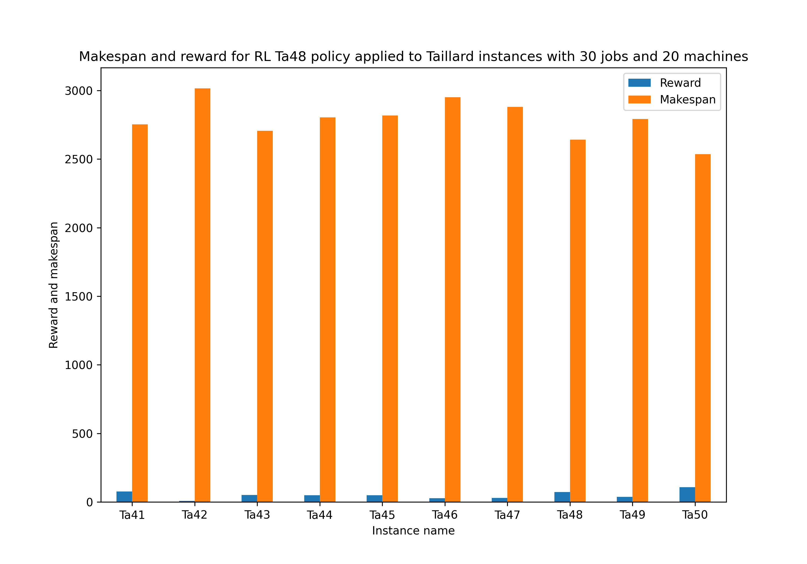

# Permutation-Augmented Job Shop Scheduling

## Dispatching rules evaluation

|    | Instance name   |   FIFO makespan  |   MWKR makespan  |
|---:|:----------------|-----------------:|-----------------:|
|  0 | Ta41            |             2543 |             2632 |
|  1 | Ta42            |             2578 |             2401 |
|  2 | Ta43            |             2506 |             2385 |
|  3 | Ta44            |             2555 |             2532 |
|  4 | Ta45            |             2565 |             2431 |
|  5 | Ta46            |             2617 |             2485 |
|  6 | Ta47            |             2508 |             2301 |
|  7 | Ta48            |             2541 |             2350 |
|  8 | Ta49            |             2550 |             2474 |
|  9 | Ta50            |             2531 |             2496 |

## PPO policy evaluation without permutation trained on 2500 episodes

### TA41

|    | Instance name   |   RL reward |   RL makespan | 
|---:|:----------------|----------:|------------:|
|  0 | Ta41            |  94.5253  |        2660 |
|  1 | Ta42            |   6.48485 |        3027 |
|  2 | Ta43            |  76.5253  |        2579 |
|  3 | Ta44            | -12.8081  |        3112 |
|  4 | Ta45            |  67.798   |        2729 |
|  5 | Ta46            |  24.505   |        2961 |
|  6 | Ta47            |  -3.77778 |        3041 |
|  7 | Ta48            |  25.4949  |        2871 |
|  8 | Ta49            |  38.0202  |        2787 |
|  9 | Ta50            |  16.7071  |        2983 |

|    | Instance name   | RL makespan |   FIFO makespan  |   MWKR makespan  |
|---:|:----------------|------------:|-----------------:|-----------------:|
|  0 | Ta41            |        2660 |             2543 |             2632 |
|  1 | Ta42            |        3027 |             2578 |             2401 |
|  2 | Ta43            |        2579 |             2506 |             2385 |
|  3 | Ta44            |        3112 |             2555 |             2532 |
|  4 | Ta45            |        2729 |             2565 |             2431 |
|  5 | Ta46            |        2961 |             2617 |             2485 |
|  6 | Ta47            |        3041 |             2508 |             2301 |
|  7 | Ta48            |        2871 |             2541 |             2350 |
|  8 | Ta49            |        2787 |             2550 |             2474 |
|  9 | Ta50            |        2983 |             2531 |             2496 |

### TA42

|    | Instance name   |   RL reward |   RL makespan |
|---:|:----------------|----------:|------------:|
|  0 | Ta41            |  51.0909  |        2875 |
|  1 | Ta42            |  79.6162  |        2665 |
|  2 | Ta43            |   9.65657 |        2910 |
|  3 | Ta44            |  23.7576  |        2931 |
|  4 | Ta45            |  54.4646  |        2795 |
|  5 | Ta46            |  42.6869  |        2871 |
|  6 | Ta47            |  94       |        2557 |
|  7 | Ta48            |  66.5051  |        2668 |
|  8 | Ta49            |  25.4949  |        2849 |
|  9 | Ta50            |  51.4545  |        2811 |

|    | Instance name   | RL makespan |   FIFO makespan  |   MWKR makespan  |
|---:|:----------------|------------:|-----------------:|-----------------:|
|  0 | Ta41            |        2875 |             2543 |             2632 |
|  1 | Ta42            |        2665 |             2578 |             2401 |
|  2 | Ta43            |        2910 |             2506 |             2385 |
|  3 | Ta44            |        2931 |             2555 |             2532 |
|  4 | Ta45            |        2795 |             2565 |             2431 |
|  5 | Ta46            |        2871 |             2617 |             2485 |
|  6 | Ta47            |        2557 |             2508 |             2301 |
|  7 | Ta48            |        2668 |             2541 |             2350 |
|  8 | Ta49            |        2849 |             2550 |             2474 |
|  9 | Ta50            |        2811 |             2531 |             2496 |

### TA43

|    | Instance name   |   RL reward |   RL makespan |
|---:|:----------------|----------:|------------:|
|  0 | Ta41            | -40.4242  |        3328 |
|  1 | Ta42            |  25.4747  |        2933 |
|  2 | Ta43            |  29.8586  |        2810 |
|  3 | Ta44            |  38.7071  |        2857 |
|  4 | Ta45            |  30.0202  |        2916 |
|  5 | Ta46            |   1.27273 |        3076 |
|  6 | Ta47            | -27.0101  |        3156 |
|  7 | Ta48            |  19.4343  |        2901 |
|  8 | Ta49            |  -9.85859 |        3024 |
|  9 | Ta50            |  46.6061  |        2835 |

|    | Instance name   | RL makespan |   FIFO makespan  |   MWKR makespan  |
|---:|:----------------|------------:|-----------------:|-----------------:|
|  0 | Ta41            |        3328 |             2543 |             2632 |
|  1 | Ta42            |        2933 |             2578 |             2401 |
|  2 | Ta43            |        2810 |             2506 |             2385 |
|  3 | Ta44            |        2857 |             2555 |             2532 |
|  4 | Ta45            |        2916 |             2565 |             2431 |
|  5 | Ta46            |        3076 |             2617 |             2485 |
|  6 | Ta47            |        3156 |             2508 |             2301 |
|  7 | Ta48            |        2901 |             2541 |             2350 |
|  8 | Ta49            |        3024 |             2550 |             2474 |
|  9 | Ta50            |        2835 |             2531 |             2496 |

### TA44

|    | Instance name   |   RL reward |   RL makespan |
|---:|:----------------|----------:|------------:|
|  0 | Ta41            |   39.1717 |        2934 |
|  1 | Ta42            |   88.101  |        2623 |
|  2 | Ta43            |   20.5657 |        2856 |
|  3 | Ta44            |   99.3131 |        2557 |
|  4 | Ta45            |   75.4747 |        2691 |
|  5 | Ta46            |   31.9798 |        2924 |
|  6 | Ta47            |   35.6162 |        2846 |
|  7 | Ta48            |   13.3737 |        2931 |
|  8 | Ta49            |   28.7273 |        2833 |
|  9 | Ta50            |  110.444  |        2519 |

|    | Instance name   | RL makespan |   FIFO makespan  |   MWKR makespan  |
|---:|:----------------|------------:|-----------------:|-----------------:|
|  0 | Ta41            |        2934 |             2543 |             2632 |
|  1 | Ta42            |        2623 |             2578 |             2401 |
|  2 | Ta43            |        2856 |             2506 |             2385 |
|  3 | Ta44            |        2557 |             2555 |             2532 |
|  4 | Ta45            |        2691 |             2565 |             2431 |
|  5 | Ta46            |        2924 |             2617 |             2485 |
|  6 | Ta47            |        2846 |             2508 |             2301 |
|  7 | Ta48            |        2931 |             2541 |             2350 |
|  8 | Ta49            |        2833 |             2550 |             2474 |
|  9 | Ta50            |        2519 |             2531 |             2496 |

### TA45

|    | Instance name   |   RL reward |   RL makespan |
|---:|:----------------|----------:|------------:|
|  0 | Ta41            |   72.7071 |        2768 |
|  1 | Ta42            |   65.2727 |        2736 |
|  2 | Ta43            |   67.2323 |        2625 |
|  3 | Ta44            |  -13.4141 |        3115 |
|  4 | Ta45            |   93.0505 |        2604 |
|  5 | Ta46            |   32.3838 |        2922 |
|  6 | Ta47            |   45.3131 |        2798 |
|  7 | Ta48            |   46.303  |        2768 |
|  8 | Ta49            |   66.303  |        2647 |
|  9 | Ta50            |   56.303  |        2787 |

|    | Instance name   | RL makespan |   FIFO makespan  |   MWKR makespan  |
|---:|:----------------|------------:|-----------------:|-----------------:|
|  0 | Ta41            |        2768 |             2543 |             2632 |
|  1 | Ta42            |        2736 |             2578 |             2401 |
|  2 | Ta43            |        2625 |             2506 |             2385 |
|  3 | Ta44            |        3115 |             2555 |             2532 |
|  4 | Ta45            |        2604 |             2565 |             2431 |
|  5 | Ta46            |        2922 |             2617 |             2485 |
|  6 | Ta47            |        2798 |             2508 |             2301 |
|  7 | Ta48            |        2768 |             2541 |             2350 |
|  8 | Ta49            |        2647 |             2550 |             2474 |
|  9 | Ta50            |        2787 |             2531 |             2496 |

### TA46

|    | Instance name   |   RL reward |   RL makespan |
|---:|:----------------|----------:|------------:|
|  0 | Ta41            |   23.4141 |        3012 |
|  1 | Ta42            |   15.1717 |        2984 |
|  2 | Ta43            |   33.899  |        2790 |
|  3 | Ta44            |   18.101  |        2959 |
|  4 | Ta45            |  -11.1919 |        3120 |
|  5 | Ta46            |   64.7071 |        2762 |
|  6 | Ta47            |   67.9394 |        2686 |
|  7 | Ta48            |   56.6061 |        2717 |
|  8 | Ta49            |   40.8485 |        2773 |
|  9 | Ta50            |   89.8384 |        2621 |

|    | Instance name   | RL makespan |   FIFO makespan  |   MWKR makespan  |
|---:|:----------------|------------:|-----------------:|-----------------:|
|  0 | Ta41            |        3012 |             2543 |             2632 |
|  1 | Ta42            |        2984 |             2578 |             2401 |
|  2 | Ta43            |        2790 |             2506 |             2385 |
|  3 | Ta44            |        2959 |             2555 |             2532 |
|  4 | Ta45            |        3120 |             2565 |             2431 |
|  5 | Ta46            |        2762 |             2617 |             2485 |
|  6 | Ta47            |        2686 |             2508 |             2301 |
|  7 | Ta48            |        2717 |             2541 |             2350 |
|  8 | Ta49            |        2773 |             2550 |             2474 |
|  9 | Ta50            |        2621 |             2531 |             2496 |

### TA47

|    | Instance name   |   RL reward |   RL makespan |
|---:|:----------------|----------:|------------:|
|  0 | Ta41            |  29.4747  |        2982 |
|  1 | Ta42            |  87.0909  |        2628 |
|  2 | Ta43            |  58.7475  |        2667 |
|  3 | Ta44            | -23.1111  |        3163 |
|  4 | Ta45            |  53.6566  |        2799 |
|  5 | Ta46            |  29.9596  |        2934 |
|  6 | Ta47            | 113.192   |        2462 |
|  7 | Ta48            |   1.65657 |        2989 |
|  8 | Ta49            |  35.3939  |        2800 |
|  9 | Ta50            |   9.23232 |        3020 |

|    | Instance name   | RL makespan |   FIFO makespan  |   MWKR makespan  |
|---:|:----------------|------------:|-----------------:|-----------------:|
|  0 | Ta41            |        2982 |             2543 |             2632 |
|  1 | Ta42            |        2628 |             2578 |             2401 |
|  2 | Ta43            |        2667 |             2506 |             2385 |
|  3 | Ta44            |        3163 |             2555 |             2532 |
|  4 | Ta45            |        2799 |             2565 |             2431 |
|  5 | Ta46            |        2934 |             2617 |             2485 |
|  6 | Ta47            |        2462 |             2508 |             2301 |
|  7 | Ta48            |        2989 |             2541 |             2350 |
|  8 | Ta49            |        2800 |             2550 |             2474 |
|  9 | Ta50            |        3020 |             2531 |             2496 |

### TA48

|    | Instance name   |   RL reward |   RL makespan |
|---:|:----------------|----------:|------------:|
|  0 | Ta41            |  75.5354  |        2754 |
|  1 | Ta42            |   8.70707 |        3016 |
|  2 | Ta43            |  50.8687  |        2706 |
|  3 | Ta44            |  49.4141  |        2804 |
|  4 | Ta45            |  49.8182  |        2818 |
|  5 | Ta46            |  26.5253  |        2951 |
|  6 | Ta47            |  28.7475  |        2880 |
|  7 | Ta48            |  71.9596  |        2641 |
|  8 | Ta49            |  36.8081  |        2793 |
|  9 | Ta50            | 106.808   |        2537 |

|    | Instance name   | RL makespan |   FIFO makespan  |   MWKR makespan  |
|---:|:----------------|------------:|-----------------:|-----------------:|
|  0 | Ta41            |        2754 |             2543 |             2632 |
|  1 | Ta42            |        3016 |             2578 |             2401 |
|  2 | Ta43            |        2706 |             2506 |             2385 |
|  3 | Ta44            |        2804 |             2555 |             2532 |
|  4 | Ta45            |        2818 |             2565 |             2431 |
|  5 | Ta46            |        2951 |             2617 |             2485 |
|  6 | Ta47            |        2880 |             2508 |             2301 |
|  7 | Ta48            |        2641 |             2541 |             2350 |
|  8 | Ta49            |        2793 |             2550 |             2474 |
|  9 | Ta50            |        2537 |             2531 |             2496 |

### TA49

|    | Instance name   |   RL reward |   RL makespan |
|---:|:----------------|----------:|------------:|
|  0 | Ta41            |  -8.90909 |        3172 |
|  1 | Ta42            |  62.8485  |        2748 |
|  2 | Ta43            |  13.899   |        2889 |
|  3 | Ta44            |  51.6364  |        2793 |
|  4 | Ta45            |  -6.34343 |        3096 |
|  5 | Ta46            |  34.6061  |        2911 |
|  6 | Ta47            |  49.3535  |        2778 |
|  7 | Ta48            |  38.0202  |        2809 |
|  8 | Ta49            |  66.303   |        2647 |
|  9 | Ta50            |  49.0303  |        2823 |

|    | Instance name   | RL makespan |   FIFO makespan  |   MWKR makespan  |
|---:|:----------------|------------:|-----------------:|-----------------:|
|  0 | Ta41            |        3172 |             2543 |             2632 |
|  1 | Ta42            |        2748 |             2578 |             2401 |
|  2 | Ta43            |        2889 |             2506 |             2385 |
|  3 | Ta44            |        2793 |             2555 |             2532 |
|  4 | Ta45            |        3096 |             2565 |             2431 |
|  5 | Ta46            |        2911 |             2617 |             2485 |
|  6 | Ta47            |        2778 |             2508 |             2301 |
|  7 | Ta48            |        2809 |             2541 |             2350 |
|  8 | Ta49            |        2647 |             2550 |             2474 |
|  9 | Ta50            |        2823 |             2531 |             2496 |

### TA50

|    | Instance name   |   RL reward |   RL makespan |
|---:|:----------------|----------:|------------:|
|  0 | Ta41            |  72.303   |        2770 |
|  1 | Ta42            |  37.3939  |        2874 |
|  2 | Ta43            |  44.202   |        2739 |
|  3 | Ta44            |  28.404   |        2908 |
|  4 | Ta45            |  34.8687  |        2892 |
|  5 | Ta46            |  63.2929  |        2769 |
|  6 | Ta47            |  30.9697  |        2869 |
|  7 | Ta48            |  -4.60606 |        3020 |
|  8 | Ta49            |  39.4343  |        2780 |
|  9 | Ta50            | 117.313   |        2485 |

|    | Instance name   | RL makespan |   FIFO makespan  |   MWKR makespan  |
|---:|:----------------|------------:|-----------------:|-----------------:|
|  0 | Ta41            |        2770 |             2543 |             2632 |
|  1 | Ta42            |        2874 |             2578 |             2401 |
|  2 | Ta43            |        2739 |             2506 |             2385 |
|  3 | Ta44            |        2908 |             2555 |             2532 |
|  4 | Ta45            |        2892 |             2565 |             2431 |
|  5 | Ta46            |        2769 |             2617 |             2485 |
|  6 | Ta47            |        2869 |             2508 |             2301 |
|  7 | Ta48            |        3020 |             2541 |             2350 |
|  8 | Ta49            |        2780 |             2550 |             2474 |
|  9 | Ta50            |        2485 |             2531 |             2496 |

