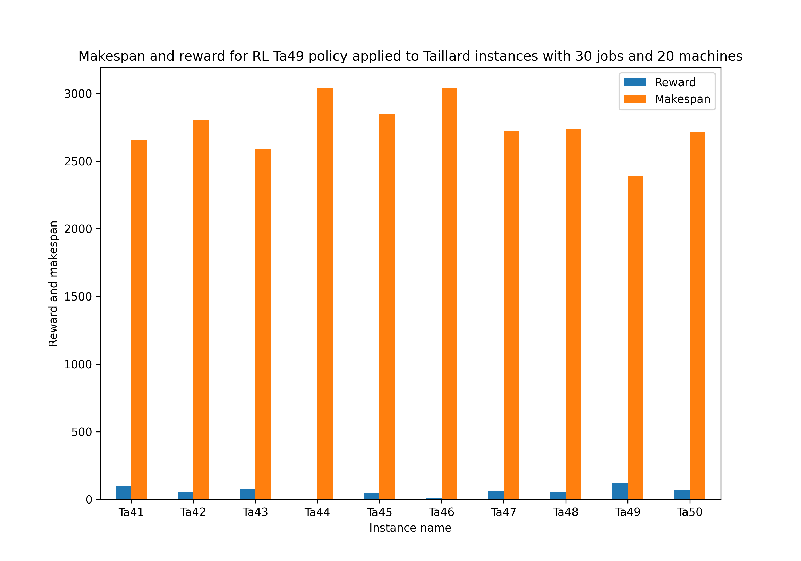
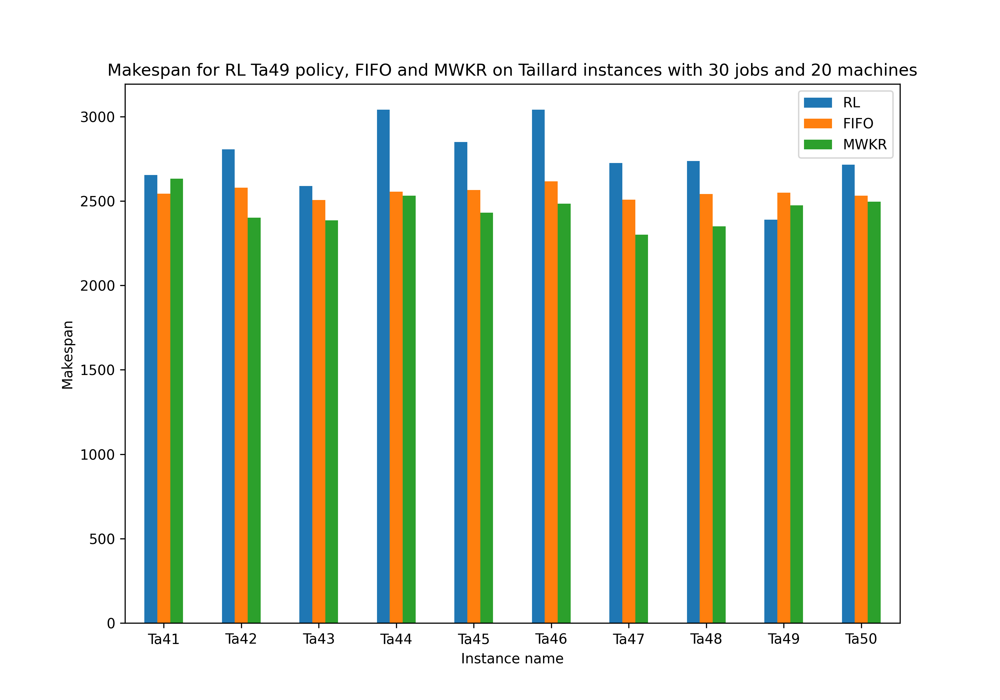
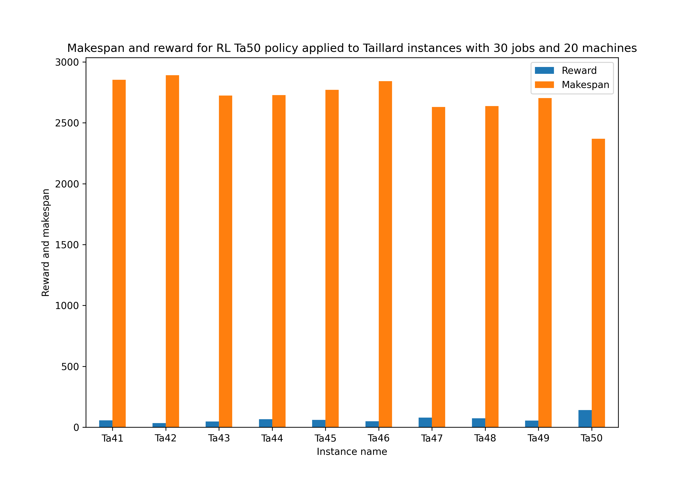
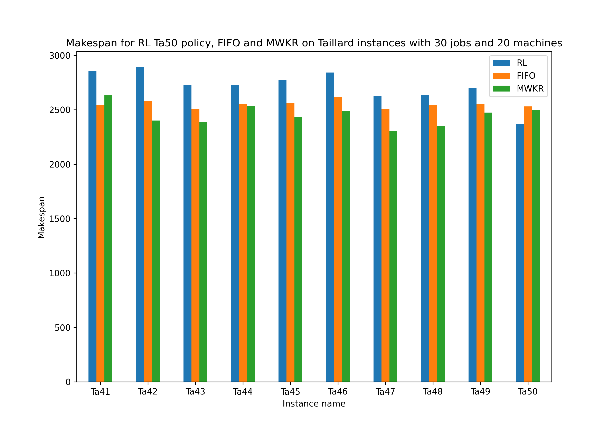

# Permutation-Augmented Job Shop Scheduling

# Best known lower and upper bounds

|    | Instance name   |   Lower bound    |   Upper bound          |
|---:|:----------------|-----------------:|-----------------------:|
|  0 | Ta41            |    1906(CPO2015) |  2006(Shylo2008)(sol)  |
|  1 | Ta42            |    1884(CPO2015) |	1939(PMAEDC2019)(sol)  |   
|  2 | Ta43            |    1809(Va1995)  |	1846(TSPR2013)(sol)    |     
|  3 | Ta44            |    1948(CPO2015) |	1979(PMAEDC2019)(sol)  |       
|  4 | Ta45            |    1997(Va1995)  |	2000(NS2001)(sol)      |   
|  5 | Ta46            |    1957(CPO2015) |	2006(Sh2012)(sol)      |   
|  6 | Ta47            |    1807(CPO2015) |	1889(TSPR2013)(sol)    |     
|  7 | Ta48            |    1912(Va1995)  |	1937(GTA2017)(sol)     |    
|  8 | Ta49            |    1931(CPO2015) |	1963(TSPR2013)(sol)    |     
|  9 | Ta50            |    1833(CPO2015) |	1923(TSPR2013)(sol)    |     

	

## Dispatching rules evaluation

|    | Instance name   |   FIFO makespan  |   MWKR makespan  |
|---:|:----------------|-----------------:|-----------------:|
|  0 | Ta41            |             2543 |             2632 |
|  1 | Ta42            |             2578 |             2401 |
|  2 | Ta43            |             2506 |             2385 |
|  3 | Ta44            |             2555 |             2532 |
|  4 | Ta45            |             2565 |             2431 |
|  5 | Ta46            |             2617 |             2485 |
|  6 | Ta47            |             2508 |             2301 |
|  7 | Ta48            |             2541 |             2350 |
|  8 | Ta49            |             2550 |             2474 |
|  9 | Ta50            |             2531 |             2496 |

## PPO policy evaluation without permutation trained on 25000 episodes

### TA41

|    | Instance name   |   RL reward |   RL makespan | 
|---:|:----------------|----------:|------------:|
|  0 | Ta41            | 133.515    |        2467 |
|  1 | Ta42            |  95.1717   |        2588 |
|  2 | Ta43            |   0.565658 |        2955 |
|  3 | Ta44            |  24.7677   |        2926 |
|  4 | Ta45            |  38.5051   |        2874 |
|  5 | Ta46            |  81.4747   |        2679 |
|  6 | Ta47            |  39.2525   |        2828 |
|  7 | Ta48            |  44.0808   |        2779 |
|  8 | Ta49            |  78.0202   |        2589 |
|  9 | Ta50            |  96.9091   |        2586 |

|    | Instance name   | RL makespan |   FIFO makespan  |   MWKR makespan  |
|---:|:----------------|------------:|-----------------:|-----------------:|
|  0 | Ta41            |        2467 |             2543 |             2632 |
|  1 | Ta42            |        2588 |             2578 |             2401 |
|  2 | Ta43            |        2955 |             2506 |             2385 |
|  3 | Ta44            |        2926 |             2555 |             2532 |
|  4 | Ta45            |        2874 |             2565 |             2431 |
|  5 | Ta46            |        2679 |             2617 |             2485 |
|  6 | Ta47            |        2828 |             2508 |             2301 |
|  7 | Ta48            |        2779 |             2541 |             2350 |
|  8 | Ta49            |        2589 |             2550 |             2474 |
|  9 | Ta50            |        2586 |             2531 |             2496 |

### TA42

|    | Instance name   |   RL reward |   RL makespan |
|---:|:----------------|----------:|------------:|
|  0 | Ta41            |  59.3737  |        2834 |
|  1 | Ta42            | 111.131   |        2509 |
|  2 | Ta43            |  54.5051  |        2688 |
|  3 | Ta44            | -90.9899  |        3499 |
|  4 | Ta45            |  51.0303  |        2812 |
|  5 | Ta46            | -33.6768  |        3249 |
|  6 | Ta47            |  93.1919  |        2561 |
|  7 | Ta48            |   3.07071 |        2982 |
|  8 | Ta49            |  -8.84848 |        3019 |
|  9 | Ta50            |   7.41414 |        3029 |

|    | Instance name   | RL makespan |   FIFO makespan  |   MWKR makespan  |
|---:|:----------------|------------:|-----------------:|-----------------:|
|  0 | Ta41            |        2834 |             2543 |             2632 |
|  1 | Ta42            |        2509 |             2578 |             2401 |
|  2 | Ta43            |        2688 |             2506 |             2385 |
|  3 | Ta44            |        3499 |             2555 |             2532 |
|  4 | Ta45            |        2812 |             2565 |             2431 |
|  5 | Ta46            |        3249 |             2617 |             2485 |
|  6 | Ta47            |        2561 |             2508 |             2301 |
|  7 | Ta48            |        2982 |             2541 |             2350 |
|  8 | Ta49            |        3019 |             2550 |             2474 |
|  9 | Ta50            |        3029 |             2531 |             2496 |

### TA43

|    | Instance name   |   RL reward |   RL makespan |
|---:|:----------------|----------:|------------:|
|  0 | Ta41            |  18.5657  |        3036 |
|  1 | Ta42            |  70.1212  |        2712 |
|  2 | Ta43            | 114.707   |        2390 |
|  3 | Ta44            |  55.4747  |        2774 |
|  4 | Ta45            |   6.9899  |        3030 |
|  5 | Ta46            |  -1.15152 |        3088 |
|  6 | Ta47            |  79.2525  |        2630 |
|  7 | Ta48            |  77.0101  |        2616 |
|  8 | Ta49            |  26.101   |        2846 |
|  9 | Ta50            |  38.3232  |        2876 |

|    | Instance name   | RL makespan |   FIFO makespan  |   MWKR makespan  |
|---:|:----------------|------------:|-----------------:|-----------------:|
|  0 | Ta41            |        3036 |             2543 |             2632 |
|  1 | Ta42            |        2712 |             2578 |             2401 |
|  2 | Ta43            |        2390 |             2506 |             2385 |
|  3 | Ta44            |        2774 |             2555 |             2532 |
|  4 | Ta45            |        3030 |             2565 |             2431 |
|  5 | Ta46            |        3088 |             2617 |             2485 |
|  6 | Ta47            |        2630 |             2508 |             2301 |
|  7 | Ta48            |        2616 |             2541 |             2350 |
|  8 | Ta49            |        2846 |             2550 |             2474 |
|  9 | Ta50            |        2876 |             2531 |             2496 |

### TA44

|    | Instance name   |   RL reward |   RL makespan |
|---:|:----------------|----------:|------------:|
|  0 | Ta41            |  43.0101  |        2915 |
|  1 | Ta42            |  45.2727  |        2835 |
|  2 | Ta43            |  62.9899  |        2646 |
|  3 | Ta44            |  95.2727  |        2577 |
|  4 | Ta45            |  46.7879  |        2833 |
|  5 | Ta46            |  61.2727  |        2779 |
|  6 | Ta47            |  72.1818  |        2665 |
|  7 | Ta48            |  -8.64647 |        3040 |
|  8 | Ta49            |  57.6162  |        2690 |
|  9 | Ta50            | 115.293   |        2495 |

|    | Instance name   | RL makespan |   FIFO makespan  |   MWKR makespan  |
|---:|:----------------|------------:|-----------------:|-----------------:|
|  0 | Ta41            |        2915 |             2543 |             2632 |
|  1 | Ta42            |        2835 |             2578 |             2401 |
|  2 | Ta43            |        2646 |             2506 |             2385 |
|  3 | Ta44            |        2577 |             2555 |             2532 |
|  4 | Ta45            |        2833 |             2565 |             2431 |
|  5 | Ta46            |        2779 |             2617 |             2485 |
|  6 | Ta47            |        2665 |             2508 |             2301 |
|  7 | Ta48            |        3040 |             2541 |             2350 |
|  8 | Ta49            |        2690 |             2550 |             2474 |
|  9 | Ta50            |        2495 |             2531 |             2496 |

### TA45

|    | Instance name   |   RL reward |   RL makespan |
|---:|:----------------|----------:|------------:|
|  0 | Ta41            |  68.6667  |        2788 |
|  1 | Ta42            |  87.2929  |        2627 |
|  2 | Ta43            |   1.57576 |        2950 |
|  3 | Ta44            |  15.4747  |        2972 |
|  4 | Ta45            | 137.495   |        2384 |
|  5 | Ta46            | -46.404   |        3312 |
|  6 | Ta47            |  67.1313  |        2690 |
|  7 | Ta48            |  64.2828  |        2679 |
|  8 | Ta49            |  46.101   |        2747 |
|  9 | Ta50            |  85.596   |        2642 |

|    | Instance name   | RL makespan |   FIFO makespan  |   MWKR makespan  |
|---:|:----------------|------------:|-----------------:|-----------------:|
|  0 | Ta41            |        2788 |             2543 |             2632 |
|  1 | Ta42            |        2627 |             2578 |             2401 |
|  2 | Ta43            |        2950 |             2506 |             2385 |
|  3 | Ta44            |        2972 |             2555 |             2532 |
|  4 | Ta45            |        2384 |             2565 |             2431 |
|  5 | Ta46            |        3312 |             2617 |             2485 |
|  6 | Ta47            |        2690 |             2508 |             2301 |
|  7 | Ta48            |        2679 |             2541 |             2350 |
|  8 | Ta49            |        2747 |             2550 |             2474 |
|  9 | Ta50            |        2642 |             2531 |             2496 |

### TA46

|    | Instance name   |   RL reward |   RL makespan |
|---:|:----------------|----------:|------------:|
|  0 | Ta41            |   38.1616 |        2939 |
|  1 | Ta42            |   34.5657 |        2888 |
|  2 | Ta43            |  -24.8889 |        3081 |
|  3 | Ta44            |   22.9495 |        2935 |
|  4 | Ta45            |  -27.1515 |        3199 |
|  5 | Ta46            |  133.596  |        2421 |
|  6 | Ta47            |  -14.4848 |        3094 |
|  7 | Ta48            |   62.8687 |        2686 |
|  8 | Ta49            |   16      |        2896 |
|  9 | Ta50            |  126.606  |        2439 |

|    | Instance name   | RL makespan |   FIFO makespan  |   MWKR makespan  |
|---:|:----------------|------------:|-----------------:|-----------------:|
|  0 | Ta41            |        2939 |             2543 |             2632 |
|  1 | Ta42            |        2888 |             2578 |             2401 |
|  2 | Ta43            |        3081 |             2506 |             2385 |
|  3 | Ta44            |        2935 |             2555 |             2532 |
|  4 | Ta45            |        3199 |             2565 |             2431 |
|  5 | Ta46            |        2421 |             2617 |             2485 |
|  6 | Ta47            |        3094 |             2508 |             2301 |
|  7 | Ta48            |        2686 |             2541 |             2350 |
|  8 | Ta49            |        2896 |             2550 |             2474 |
|  9 | Ta50            |        2439 |             2531 |             2496 |

### TA47

|    | Instance name   |   RL reward |   RL makespan |
|---:|:----------------|----------:|------------:|
|  0 | Ta41            |   14.1212 |        3058 |
|  1 | Ta42            |   25.6768 |        2932 |
|  2 | Ta43            |   34.303  |        2788 |
|  3 | Ta44            |   31.8384 |        2891 |
|  4 | Ta45            |   42.1414 |        2856 |
|  5 | Ta46            |   27.9394 |        2944 |
|  6 | Ta47            |  108.545  |        2485 |
|  7 | Ta48            |  -20.3636 |        3098 |
|  8 | Ta49            |   85.899  |        2550 |
|  9 | Ta50            |  -12.7879 |        3129 |

|    | Instance name   | RL makespan |   FIFO makespan  |   MWKR makespan  |
|---:|:----------------|------------:|-----------------:|-----------------:|
|  0 | Ta41            |        3058 |             2543 |             2632 |
|  1 | Ta42            |        2932 |             2578 |             2401 |
|  2 | Ta43            |        2788 |             2506 |             2385 |
|  3 | Ta44            |        2891 |             2555 |             2532 |
|  4 | Ta45            |        2856 |             2565 |             2431 |
|  5 | Ta46            |        2944 |             2617 |             2485 |
|  6 | Ta47            |        2485 |             2508 |             2301 |
|  7 | Ta48            |        3098 |             2541 |             2350 |
|  8 | Ta49            |        2550 |             2550 |             2474 |
|  9 | Ta50            |        3129 |             2531 |             2496 |

### TA48

|    | Instance name   |   RL reward |   RL makespan |
|---:|:----------------|----------:|------------:|
|  0 | Ta41            |   54.3232 |        2859 |
|  1 | Ta42            |   75.5758 |        2685 |
|  2 | Ta43            |    2.9899 |        2943 |
|  3 | Ta44            |   38.303  |        2859 |
|  4 | Ta45            |   54.4646 |        2795 |
|  5 | Ta46            |   42.6869 |        2871 |
|  6 | Ta47            |   41.8788 |        2815 |
|  7 | Ta48            |  134.586  |        2331 |
|  8 | Ta49            |   40.8485 |        2773 |
|  9 | Ta50            |  -80.6667 |        3465 |

|    | Instance name   | RL makespan |   FIFO makespan  |   MWKR makespan  |
|---:|:----------------|------------:|-----------------:|-----------------:|
|  0 | Ta41            |        2859 |             2543 |             2632 |
|  1 | Ta42            |        2685 |             2578 |             2401 |
|  2 | Ta43            |        2943 |             2506 |             2385 |
|  3 | Ta44            |        2859 |             2555 |             2532 |
|  4 | Ta45            |        2795 |             2565 |             2431 |
|  5 | Ta46            |        2871 |             2617 |             2485 |
|  6 | Ta47            |        2815 |             2508 |             2301 |
|  7 | Ta48            |        2331 |             2541 |             2350 |
|  8 | Ta49            |        2773 |             2550 |             2474 |
|  9 | Ta50            |        3465 |             2531 |             2496 |

### TA49

|    | Instance name   |   RL reward |   RL makespan |
|---:|:----------------|----------:|------------:|
|  0 | Ta41            |  95.7374  |        2654 |
|  1 | Ta42            |  51.1313  |        2806 |
|  2 | Ta43            |  74.7071  |        2588 |
|  3 | Ta44            |   1.53535 |        3041 |
|  4 | Ta45            |  43.3535  |        2850 |
|  5 | Ta46            |   8.34344 |        3041 |
|  6 | Ta47            |  60.0606  |        2725 |
|  7 | Ta48            |  52.7677  |        2736 |
|  8 | Ta49            | 118.424   |        2389 |
|  9 | Ta50            |  70.6465  |        2716 |

|    | Instance name   | RL makespan |   FIFO makespan  |   MWKR makespan  |
|---:|:----------------|------------:|-----------------:|-----------------:|
|  0 | Ta41            |        2654 |             2543 |             2632 |
|  1 | Ta42            |        2806 |             2578 |             2401 |
|  2 | Ta43            |        2588 |             2506 |             2385 |
|  3 | Ta44            |        3041 |             2555 |             2532 |
|  4 | Ta45            |        2850 |             2565 |             2431 |
|  5 | Ta46            |        3041 |             2617 |             2485 |
|  6 | Ta47            |        2725 |             2508 |             2301 |
|  7 | Ta48            |        2736 |             2541 |             2350 |
|  8 | Ta49            |        2389 |             2550 |             2474 |
|  9 | Ta50            |        2716 |             2531 |             2496 |

### TA50

|    | Instance name   |   RL reward |   RL makespan |
|---:|:----------------|----------:|------------:|
|  0 | Ta41            |   55.5354 |        2853 |
|  1 | Ta42            |   33.9596 |        2891 |
|  2 | Ta43            |   47.4343 |        2723 |
|  3 | Ta44            |   64.9697 |        2727 |
|  4 | Ta45            |   59.5152 |        2770 |
|  5 | Ta46            |   48.3434 |        2843 |
|  6 | Ta47            |   79.2525 |        2630 |
|  7 | Ta48            |   72.5657 |        2638 |
|  8 | Ta49            |   54.7879 |        2704 |
|  9 | Ta50            |  140.545  |        2370 |

|    | Instance name   | RL makespan |   FIFO makespan  |   MWKR makespan  |
|---:|:----------------|------------:|-----------------:|-----------------:|
|  0 | Ta41            |        2853 |             2543 |             2632 |
|  1 | Ta42            |        2891 |             2578 |             2401 |
|  2 | Ta43            |        2723 |             2506 |             2385 |
|  3 | Ta44            |        2727 |             2555 |             2532 |
|  4 | Ta45            |        2770 |             2565 |             2431 |
|  5 | Ta46            |        2843 |             2617 |             2485 |
|  6 | Ta47            |        2630 |             2508 |             2301 |
|  7 | Ta48            |        2638 |             2541 |             2350 |
|  8 | Ta49            |        2704 |             2550 |             2474 |
|  9 | Ta50            |        2370 |             2531 |             2496 |

